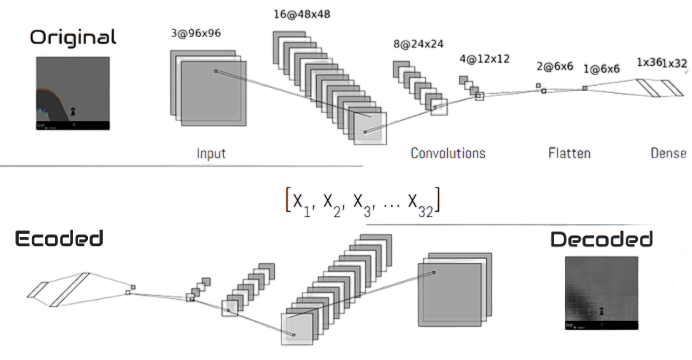

# Genetic-CarRacing-v2
Solving Gym's car racing environment with genetic algorithms, neural networks, and auto-encoders.

# Encoding
- Compressing the image observation into a 1D vector
- Allows for faster training
- Simplifies genetic model structure

## 1. Data Collection
- Random actions
- Save every nth image
  ### Image Procesing
  - Convert to grayscale
  - Remove grid patterns (backfired)
   

  | Original Image | Processed Image |
  | :----------------: | :----------------: |
  |  |  |
  |  |  |

  ### Stacking Frames
  - Stack 3 consecutive frames
  - Determine velocity & acceleration
  
   
  
  | Slow | Fast |
  | :----------------: | :----------------: |
  |   Thin outline indicates little difference   between frames|   Wide outline indicates larger difference   Vehicle has greater velocity magnitude|

## 2. Model Architecture
- Compresses 96x96x3 image input into vector of 32 values
- 99.8843% reduction
### Auto-encoder

  
## 3. Training
- Utilizing Google Colab's Tesla T4
 

# Evolutionary Algorithm
Producing the best agent through genetic selection

## Agent Model
  - Impemented in vanilla NumPy for speed and flexibility
  - Can use pyTorch for larger models

## Reporoduction values

Rank   | Mutant Offspring
| :------------: | :-------------: |
|1      |        10        |
|2      |        5         |
|3      |        4         |
|4      |        3         |
|5      |        2         |
|6      |        1         |
|Base      |        5         |
|Total Agents      |        30         |

## Training

(Max Reward)

## Results

| 
**0 Generations**
 | 
**20 Generations**
 |
| :------------: | :-------------: |
|  |  |
| 
**60 Generations**
 | 
**110 Generations**
 |
|  |  |

## Looking Back
  Yes, it would be arrested for driving under influence. In every simulation I ran however, the car learned the same winding behavior indicating that it was not a case of a local optima but rather pocesses some strategic advantage. Of course it would require further testing to determine the exact cause. I believe that removing the tiling patterns on both the grass and the track elimated some signals which could indicate the velocity of the car. On a perfectly straight track, one frame is identical to the next, providing no information regarding the velocity of the agent. By twisting through the track, each frame is different from the previous providing enough info to determine the magnitude of direction of the velocity. Now, it is possible that the winding pattern was easier for the model to learn rather than more continous actions. Outputing "left" for 5 iterations and then "right" for the next 5 could be the result of large weight values coupled with the final sigmoid activation function.
  
  ### Potential Improvements:
  - Maintain image complexity 
  - Integrate the encoder into the agent model and make the weights mutable
  - Implement mutations which change the architacture of the agent model rather than soley weight values (and record total reward/elapsed time to encourage smaller, faster models)

  

