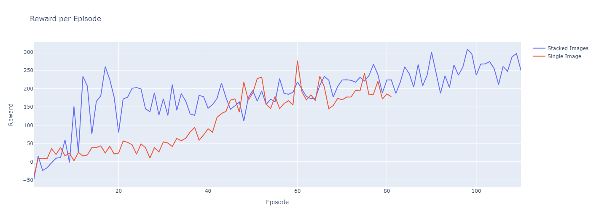
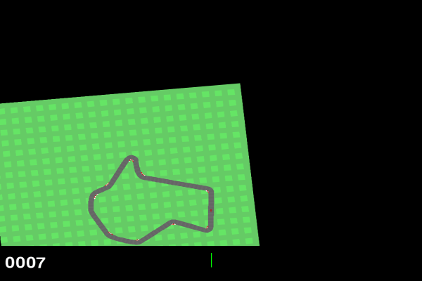

# Genetic-CarRacing-v2
Solving Gym's car racing environment with genetic algorithms, neural networks, and auto-encoders. A slight overkill for my final AP CS project, but it was fun nonetheless

# Encoding
- Compress the 96x96 RGB image into a 1D vector
- Speeds up evolutionary training 
- Simplifies genetic model architecture

## 1. Data Collection
- Random actions to gather frames
- Save every Nth image
  ### Image Procesing
  - Convert to grayscale
  - Remove grid patterns to reduce complexity
   

  | Original Image | Processed Image |
  | :----------------: | :----------------: |
  |  |  |
  |  |  |

  ### Stacking Frames
  - Stack 3 consecutive frames
  - Contains information to deduce velocity & acceleration
  
   
  
  | Slow | Fast |
  | :----------------: | :----------------: |
  |   Narrow outline indicates minimal   difference between frames|   Broad overlay difference suggests   vehicle possesses greater speed|

## 2. Model Architecture
- Compresses 96x96x3 image input into vector of 32 values
- 99.8843% reduction
- Feed output of encoder to input of evolutionary model
### Auto-encoder

  
## 3. Training
- Utilizing Google Colab's Tesla T4 GPU
 

# Evolutionary Algorithm
Producing the best agent through genetic selection

## Agent Model
  - Impemented in vanilla NumPy for speed and flexibility (reduces uneccesary overhead)
  - Potentially replace with pyTorch for larger models 
  - Shown below is the model archtecture for each individual

## Reporoduction
  - The most successful agents of each generation make up the base population for the next generation
  - Each one also produces x number of "mutated" offspring with random values added to each weight
  - The table below indicates how many offspring each individual produces to maintain the population size of 30

Rank   | Mutant Offspring
| :------------: | :-------------: |
|1      |        10        |
|2      |        5         |
|3      |        4         |
|4      |        3         |
|5      |        2         |
|6      |        1         |
|Base      |        5         |
|Total Agents      |        30         |

## Training

(Max Reward)

## Results

| 
**0 Generations**
 | 
**20 Generations**
 |
| :------------: | :-------------: |
|  |  |
| 
**60 Generations**
 | 
**110 Generations**
 |
|  |  |

## Looking Back
  Yes I know, this agent would be pulled over for DUI. In every simulation, the car learned the same winding behavior indicating that this behavior is not a local optima but rather provides some sort of strategic advantage. Of course it, with the nature of black box nueral networks, would require further testing to determine the exact cause. I'm under the impression that removing the tiling patterns on both the grass and the track elimated some indicators to determine the velocity of the car. On a perfectly straight track, each frame is identical to the next, providing no information regarding the velocity of the agent. By twisting through the track, the overlaying of images produces varience to determine the magnitude of direction of the car. Obviously, it is possible that the winding pattern was simply easier for the model to learn rather than continous actions. Outputing "left" for 5 iterations and "right" for the next 5 could merely be the result of large weight values coupled with the final sigmoid activation function.
  
  ### Potential Improvements:
  - Maintain image complexity 
  - Integrate the encoder into the agent model and make the weights mutable
  - Implement mutations which change the architacture of the agent model rather than soley weight values (and record total reward/elapsed time to encourage smaller, faster models)

  

